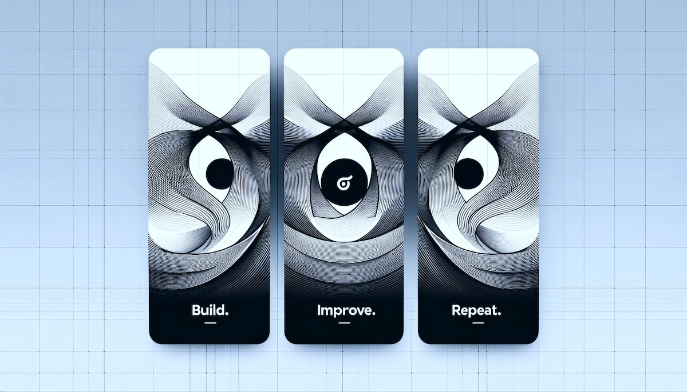

<h1 align="center">Blockchain Engineer</h1>

  

    <h2>🌟 About Me:</h2>
    
╰┈➤ Full-stack blockchain engineer

    
╰┈➤ Goal: Client's satisfication 

    
╰┈➤ Solving problems like madman

    
╰┈➤ Passionate with learning new techs

    
╰┈➤ Prefer perfectionism

  
 
  

  <h2>🌟 Skills</h2>
  
Blockchain | Rust | Golang | T3 Stack

  

  
  
  

